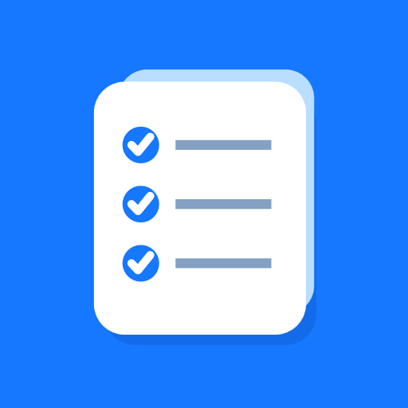

# QuizDeck

<p align="center">
  
</p>

<p align="center"><strong>AI-assisted, privacy-first employee training and certification.</strong></p>

[简体中文](README.zh-CN.md)

QuizDeck is an AI-assisted, privacy-first employee training and certification platform for enterprise question banks. It imports Excel question banks, runs offline practice and randomized mock exams, provides instant feedback and mistake review, and turns natural-language training goals into reviewable question partitions.

The current project is a lightweight Android and web client. It is designed for role training, compliance learning, operating procedures, safety requirements, and certification preparation without requiring a central account or cloud database.

## Why QuizDeck

- **Offline-first learning:** importing, answering, scoring, progress tracking, and mistake review work without an AI service.
- **Two-stage AI classification:** QuizDeck first summarizes the user's intent, waits for confirmation, then classifies the active bank in bounded batches.
- **Human-controlled results:** AI output is a candidate. Users can review membership, edit the partition name, add or remove questions, or discard the result before saving.
- **Strict boundaries:** batch results are schema-checked, deduplicated, restricted to IDs in the active bank, and restored to source order.
- **Enterprise deployment choices:** users can configure a compatible cloud endpoint or expose Ollama, vLLM, and other OpenAI-compatible services through an HTTPS intranet gateway.
- **Local data ownership:** question banks, answers, progress, mistakes, and saved partitions remain on the device by default.

## Current capabilities

| Area | Included |
| --- | --- |
| Question banks | `.xls` / `.xlsx` import, multiple local banks, source-order preservation, removable demo bank |
| Learning | Sequential practice, shuffled practice, instant answer feedback, mistake set, saved progress |
| Assessment | Randomized mock exam, answer sheet, submission confirmation, result review |
| Classification | Natural-language intent, confirmation, batching, structured validation, confidence checks, manual review |
| Model access | User-provided OpenAI-compatible base URL, model, and API key; current DeepSeek V4 preset and legacy-name migration |
| Language | Follow system, Simplified Chinese, or English; the preference is stored locally |
| Platforms | Responsive web/PWA and two Android variants built from the same Capacitor source |

Semantic duplicate detection and AI-generated adaptive review recommendations are tracked in the [roadmap](ROADMAP.md); they are not presented as completed features.

## Data and AI boundary

AI is opt-in. QuizDeck sends question content only after the user starts an AI classification workflow and confirms the interpreted goal. The active bank is then sent in controlled batches to the endpoint selected by the user. Ordinary import, practice, exams, scoring, and history do not call an AI endpoint.

Using a local or intranet model can keep question-bank content and learning data inside an organization's network boundary. Android and non-local web connections require HTTPS; plain HTTP is accepted only for loopback development addresses. Actual security still depends on network design, access control, endpoint configuration, device policy, and the selected model deployment.

On Android, the API key is encrypted with an Android Keystore-backed AES-GCM key. The web preview keeps its API key only in session storage and is still less suitable for sensitive credentials; see [PRIVACY.md](PRIVACY.md) and [SECURITY.md](SECURITY.md).

## Quick start

Requirements: Node.js 22.13 or newer and pnpm 11.19.

```bash
pnpm install
pnpm run dev
```

Run the complete verification suite:

```bash
pnpm run verify
```

The repository ships with a small, original bilingual demo bank covering product use, information security, training, and AI review. It can be permanently removed from the library. Imported banks are stored locally and are not committed to the repository.

## Android

Requirements: JDK 21, Android SDK 36, and Android Build Tools 35.

```powershell
pnpm run android:apk
```

The command builds Chinese-default and English-default APKs. Both variants retain the in-app language selector. Public production releases should be signed with a maintainer-controlled key that is never committed. See [docs/ANDROID_RELEASE.md](docs/ANDROID_RELEASE.md).

## Question-bank format

QuizDeck recognizes common Chinese and English Excel columns for number, type, prompt, answer, options, and category. Import parsing happens on the device. See [docs/QUESTION_BANK_FORMAT.md](docs/QUESTION_BANK_FORMAT.md).

## Architecture

The UI is shared by the web and Android builds. Domain modules own quiz grading, local bank storage, session restoration, AI configuration, provider transport, and partition validation. The Android shell adds a native secure-key plugin. See [docs/ARCHITECTURE.md](docs/ARCHITECTURE.md).

## Contributing

Bug reports, provider-compatibility fixtures, import-format improvements, translations, accessibility fixes, and Android build improvements are welcome. Use synthetic or properly licensed examples only, and never attach private question banks or credentials. Read [CONTRIBUTING.md](CONTRIBUTING.md) before opening a pull request.

## License

QuizDeck is licensed under the [MIT License](LICENSE). Third-party packages keep their respective licenses; see [THIRD_PARTY_NOTICES.md](THIRD_PARTY_NOTICES.md).
